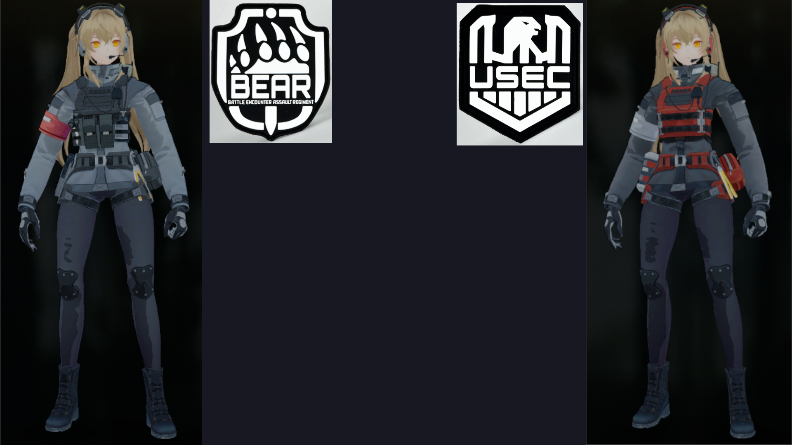

# Escape from tarkov SPT-AKI EVG EDITION
Мод для игры Escape From Tarkov, добавляющий нового торговца и вносящие различные правки

# Описание
Данный мод использует SPT-AKI, добавляющий в игру оффлайн режим.

**Особенности мода:**
- Новый торговец Евгешка с 40+ квестами
- Новый босс
- Полная переработка диких:
  - Теперь для начала игры за дикого требуется специальный предмет
  - В зависимости от кармы дикого увеличивается шанс получить вместо дикого одного из боссов
  - Во время игры за дикого время рейда теперь уменьшенно (с элементов рандома)
  - Увеличена награда к репутации со скупщиком при успешном выходе (+0.05)
  - Уменьшен штраф при убийстве боссов и его свиты (-0.05)
  - Данная опция отключается в конфиге
- Возможность сделать ЧВК боссом
- Исправление цен барахолки, скупщика и прочие правки в экономику
- Аниме ЧВК: включает анима лица и одежду для ЧВК
- Прочие правки в балансе: увеличение шансов босса и переработка их спавна, ускорение крафтов и строительства в убежище, увеличение спавном на лабе и так далее

# Установка:
1. Устанавливаем EFT и [SPT-AKI](https://hub.sp-tarkov.com/doc/entry/49-a-comprehensive-step-by-step-guide-to-installing-spt-aki-properly/)
2. Скачиваем [последнюю версию мода](https://github.com/larn503/Escape-From-Tarkov-EVG/releases/latest)
3. Закидываем папки **user** и **BepInEx** в папку с игрой
4. Настраиваем мод по необходимости в user\mods\evgeshka\config\config.json [ИНСТРУКЦИЯ ТУТ](https://github.com/larn503/Escape-From-Tarkov-EVG#%D0%BA%D0%BE%D0%BD%D1%84%D0%B8%D0%B3)
5. Запускаем Aki.Server.exe, после чего Aki.Launcher.exe
6. Для открытия торговца получаем 3 уровень и получаем квест от Прапора.
Новую игру создавать необязательно, НО аниме режим включается только до начала новой игры. Однако могу помочь перенести сохранение в случае чего.

# Конфиг
**true** - включить, **false** - выключить
- **bossChanceIncrease** (по умолчанию true) - Увеличение шанса боссов и сектантов.
- **scavRework** (по умолчанию true) - Переработка диких. Сюда входит: вход по предмету, вероятность стать боссом, рандомное время рейда, улучшение скиллов дикого от репутации, увеличение награды репутации за выход, уменьшение штрафа от убийства босса
- [animeMode](https://github.com/larn503/Escape-From-Tarkov-EVG#anime-mode) (по умолчанию false) - Аниме ЧВК. Включать до начала новой игры. При выборе головы, появляются новые варианты, убираются старые. После того, как вы выбираете сторону и голову, ваш скин автоматически станет анимешный (у юсека и бир отличаются стандартные облики). У барахольщика будут доступные другие костюмы. **Внимание**: на некоторых картах ваш скин, в том числе и руки, будут светлее, чем должны, так как их шейдер принимает свет от освещения карты, а не от текущей позиции. Это будет заметно на заводе.
- **levelImprove** (по умолчанию true) - Облегчение получение уровней после 42. Дело в том, что для перехода до 43 лвл требуется 200к опыта, а до 72 - по несколько миллионов. Данная настройка меняет это. С 43 по 50 уровней - 200к опыта за каждый, 50-60 - 250к, 60-70 - 300к, 70-78 - 500к
- **maxBots** (по умолчанию 20) - Стандартная настройка ботов на карте. Вывел я ее в случае, если игра лагает при большом количестве, либо их наоборот нехватает. Не рекомендую ее трогать, только в случае необходимости.

# Anime Mode

^Стандартные костюмы Usec и Bear^
